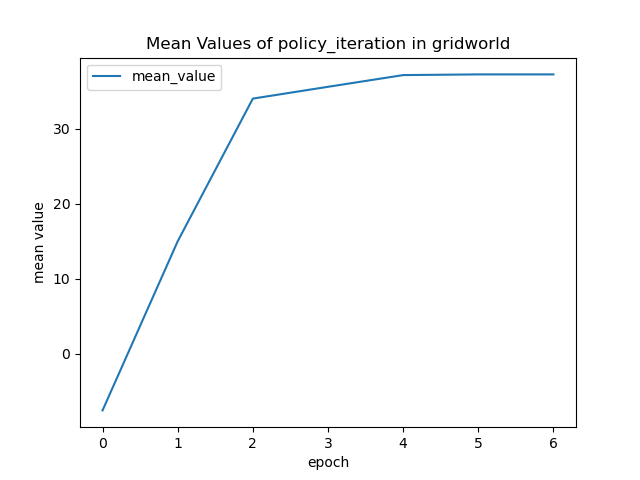
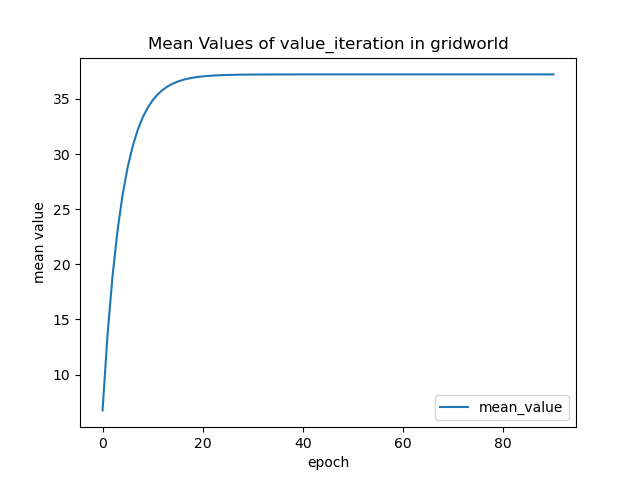

# Result - Mike Liu xl142

## Learning curves

### Gridworld

#### Policy iteration

#### Value iteration

#### SARSA

#### Q-learning

### Pendumlum

#### SARSA

#### Q-learning

## Learning curves for different values of &epsilon;

### Gridworld
#### SARSA

#### Q-learning

### Pendulum

#### SARSA

#### Q-learning

## Learning curves for different values of &alpha;

### Gridworld
#### SARSA

#### Q-learning

### Pendulum
#### SARSA

#### Q-learning

## Example Trajectories

### Gridworld
#### Policy iteration

#### Value iteration

#### SARSA

#### Q-learning

### Pendulum
#### SARSA

#### Q-learning

## Policy

### Gridworld
#### Policy iteration

#### Value iteration

#### SARSA

#### Q-learning

### Pendulum
#### SARSA

#### Q-learning

## State-Value Function

### Gridworld
#### SARSA

#### Q-learning

### Pendulum
#### SARSA

#### Q-learning

